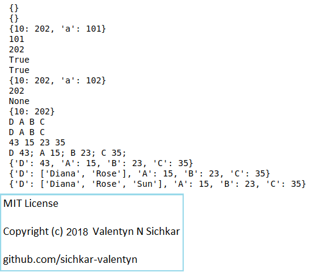

# Dictionaries in Python
How to create and use Dictionaries in Python

### Reference to:
[1] Valentyn N Sichkar. Dictionaries in Python // GitHub platform [Electronic resource]. URL: https://github.com/sichkar-valentyn/Dictionaries_in_Python (date of access: XX.XX.XXXX)

## Description
Creating, modifying and using Dictionaries in Python.

## GUI in Python

## MIT License
## Copyright (c) 2018 Valentyn N Sichkar
## github.com/sichkar-valentyn
### Reference to:
[1] Valentyn N Sichkar. Dictionaries in Python // GitHub platform [Electronic resource]. URL: https://github.com/sichkar-valentyn/Dictionaries_in_Python (date of access: XX.XX.XXXX)
